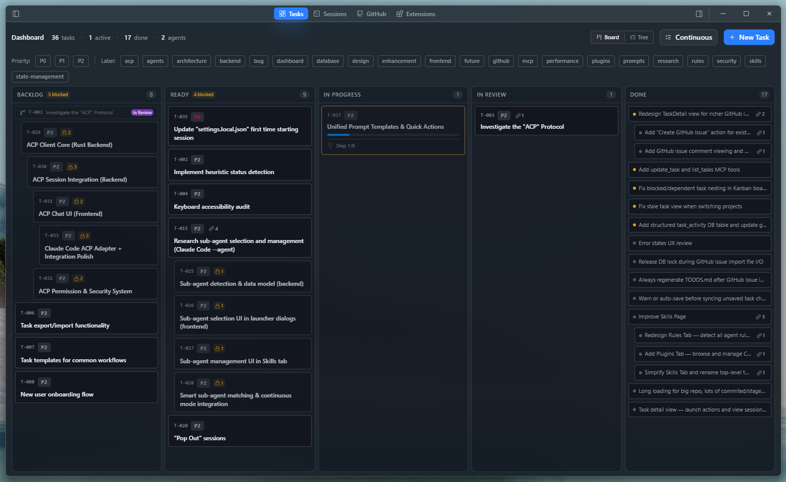
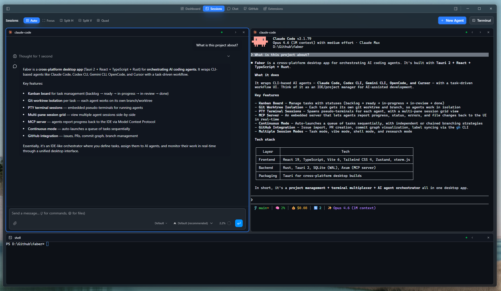

<p align="center">
  
</p>

<h1 align="center">Faber</h1>

<p align="center">
  <strong>The AI Architect for your codebase</strong>
</p>

<p align="center">
  <a href="https://github.com/orecus/faber/releases/latest"></a>
  <a href="https://github.com/orecus/faber/actions/workflows/ci.yml"></a>
  
  
  <a href="https://github.com/orecus/faber/blob/main/LICENSE"></a>
</p>

<p align="center">
  A cross-platform desktop app for orchestrating AI coding agents.<br/>
  Wraps CLI-based agents with a task-driven workflow: Kanban board, git worktree isolation, multi-pane terminal sessions, GitHub integration, skills &amp; rules management, and continuous mode.
</p>

---

<p align="center">
  
</p>
<p align="center">
  
</p>

## Install

Download the latest release for your platform from the [Releases page](https://github.com/orecus/faber/releases/latest).

| Platform | Format |
|----------|--------|
| Windows | `.exe` installer (NSIS) or portable `.exe` |
| macOS | Universal `.dmg` (ARM + Intel) |
| Linux | `.deb`, `.rpm`, `.AppImage` |

> **macOS users:** If macOS says the application is damaged, run:
> ```bash
> xattr -d com.apple.quarantine /Applications/Faber.app
> ```

## Features

- **Task-driven workflow** — Kanban board with task specs, priorities, labels, dependencies, and full lifecycle management (Backlog → Ready → In Progress → In Review → Done)
- **Multi-agent support** — Claude Code, Codex CLI, Copilot CLI, Cursor Agent, Gemini CLI, and OpenCode — all auto-detected from your PATH
- **Git worktree isolation** — each task runs in its own worktree and branch, so multiple agents can work in parallel without conflicts
- **Multi-pane session grid** — run multiple agent sessions side-by-side with drag-and-drop layout and resizable panes
- **Four session modes** — Task (structured implementation), Research (explore & plan), Vibe (freeform coding), Shell (raw terminal)
- **Continuous mode** — auto-launch a queue of ready tasks with independent or chained branching strategies
- **Prompt templates & quick actions** — configurable prompt templates with `{{variable}}` interpolation for all session types, plus one-click Quick Action buttons on session panes
- **Skills & rules** — install and manage agent skills and project rules to extend agent capabilities
- **GitHub integration** — issue import, PR creation, commit graph visualization, and label sync
- **Review workflow** — diff viewer with file list, change summary, and PR creation dialog
- **MCP server** — embedded Model Context Protocol server for real-time agent-to-app progress reporting
- **Command palette** — quick actions via <kbd>Ctrl</kbd>/<kbd>Cmd</kbd>+<kbd>K</kbd>
- **Theming** — Dark/Light × Glass/Flat (4 themes)
- **Auto-updates** — in-app update notifications with one-click install
- **OS notifications** — alerts on agent completion, errors, and waiting states (click to navigate)

## Supported Agents

Faber detects and wraps these CLI agents (must be installed separately):

| Agent | CLI Command | Default Model | Install |
|-------|------------|---------------|---------|
| **Claude Code** | `claude` | `sonnet` | `npm i -g @anthropic-ai/claude-code` |
| **Codex CLI** | `codex` | `gpt-5.3-codex` | `npm i -g @openai/codex` |
| **Copilot CLI** | `copilot` | *(Copilot default)* | [github.com/features/copilot/cli](https://github.com/features/copilot/cli) |
| **Cursor Agent** | `agent` / `cursor-agent` | `claude-4-opus` | [cursor.com](https://cursor.com/) |
| **Gemini CLI** | `gemini` | `gemini-2.5-pro` | `npm i -g @google/gemini-cli` |
| **OpenCode** | `opencode` | *(user-specified)* | `npm i -g opencode-ai` |

See [docs/supported_agents.md](docs/supported_agents.md) for detailed configuration and MCP integration info.

## Views

| View | Description |
|------|-------------|
| **Dashboard** | Kanban board — manage tasks, filter by status/priority/label, launch agent sessions |
| **Sessions** | Multi-pane terminal grid — live agent output, drag-and-drop layout, session controls |
| **GitHub** | Commit graph, issue browser, PR management |
| **Skills** | Browse, install, and manage agent skills and project rules |
| **Task Detail** | Full task editor — markdown body, metadata, dependencies, linked PRs |
| **Review** | Diff viewer — file-level changes, create PRs directly from the app |
| **Help** | In-app documentation and guides |

## Documentation

Detailed guides are available in the [`docs/`](docs/) folder.

## Tech Stack

| Layer | Technology |
|-------|-----------|
| Desktop framework | [Tauri 2](https://v2.tauri.app/) |
| Frontend | [React 19](https://react.dev/) + [TypeScript 5.7](https://www.typescriptlang.org/) |
| Bundler | [Vite 6](https://vite.dev/) |
| Styling | [Tailwind CSS 4](https://tailwindcss.com/) + [ShadCN UI](https://ui.shadcn.com/) |
| State management | [Zustand 5](https://zustand.docs.pmnd.rs/) |
| Terminal emulator | [xterm.js 6](https://xtermjs.org/) |
| Backend | [Rust](https://www.rust-lang.org/) (2021 edition) |
| Database | SQLite (WAL mode) |
| MCP server | [Axum](https://github.com/tokio-rs/axum) |

## Contributing

We welcome contributions! See [CONTRIBUTING.md](CONTRIBUTING.md) for development setup, code conventions, and the PR process.

## Thanks To

Thank you to the following projects for inspiration, references and ideas.

- [maestro](https://github.com/its-maestro-baby/maestro) - For inspiration, references, and ideas
- [svgl.app](https://svgl.app/) - For logos
- [codexmonitor.app](https://www.codexmonitor.app/) - For inspiration and ideas
- [Zed](https://zed.dev/) - For the ACP reference implementation and adapter patterns

And of course, Anthropic Claude Opus 4.6 for doing the majority of the work. :)

## License

See [LICENSE](LICENSE) for details.
